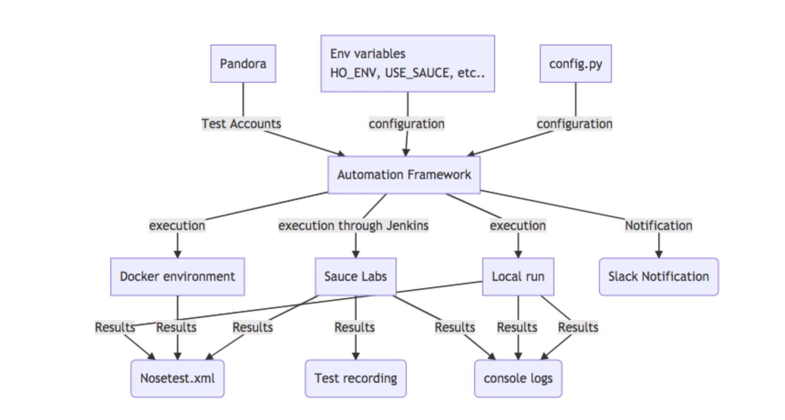

# Core Automation framework #

### Core flow



## Basic components ##

**Pages**

Represent distinct URL loads, for the most part the existing page objects;
Dashboard should cover most cases. Pages should contain very little
function beyond providing access to their sections.

**iFrame**

Represents an iframe and auto-handles context switching.

**Section**

Represent functional and/or structural areas within a page and provide
encapsulation avoiding huge pythons files.

**Element**

Represents a single page element, if the query matches more than one element
then the match will fail and you should ensure that your selector is unique.

**Elements**

Represents a list of matching elements.

## Framework docs ##
You can generate docs locally by running:
```
./automations/pages/core/docs/generate_docs.sh
```
You will then find the generated HTML docs in `automations/pages/core/docs/build/html/modules.html`

## Simple example ##
```python
class SimpleSigninTest(TestCase):

	self.driver = ...
	self.url = ...
	self.email = ...
	self.password = ...

	def test_signin(self):
		self.my_site = SigninPage(self.driver, url=self.url, name="My site")
		self.my_site.signin.perform_signin(self.email, self.password)

class SigninPage(Page):

	def setup(self):
		"""
		Place all element definitions in the 'setup' method.
		"""
		self.signin = self.section_by_selector(SignIn(self.driver), "body", "Signin section")

class SignIn(Section):

	def setup(self):
		self.email_input = self.element_by_selector("#signin_form input[name='email']", "Email field")
		self.password_input = self.element_by_selector("#signin_form input[name='password']", "Password field")
		self.signin_btn = self.element_by_selector("#signin_form button[type='submit']", "Signin button")
		self.signed_in_element = self.element_by_selector("#div.content_class", "Site element present when signin is complete").visible()

	def perform_signin(self, email, password):
		"""
		Some frequent simple actions like signin can just be combined into a single method.
		"""
		# set the fields
		self.email_input.set_text(email)
		self.password_input.set_text(password)

		# click to start signin
		self.signin_btn.click()

		# verify signin completes allowing 1 minute for completion
		self.signed_in_element.verify(timeout=60)
 ```
  
### Getting started ##

### Checkout repo and setup tools ###
# repo
git clone git@github.com:latasuresh/test2020.git
cd automations

# tool setup (if not already complete)
# make sure the python version is 2.7.X
```
brew install python2
pip install virtualenv
```


### Running tests ###

### ChromeDriver

You should have locally a version of chromedrivers that matches your local chrome version. To do that, open your chrome, and check the major version (Chrome > About Google Chrome)

Visit https://sites.google.com/a/chromium.org/chromedriver/home and download the chromedriver for you

Extract the chromedriver executable in your path. `~/bin/` if you have set that up, or `/usr/local/bin` if you're using brew and want it installed globaly.

If you want to save the virtual env setup every run then you can just do:

```
source scripts/start_virtualenv.sh
```

### Setup enviornment for the dependencies
```
pip install -r requirements.py
```

### Run tests

```
./scripts/run_tests.sh HO_ENV=staging USE_PANDORA=0 automations/browser_tests/test_evpn_login.py
```

### Running on multiple browsers

```
# browser based tests use a numerical suffix to the class name as a convention for
# the option to spin up the test in multiple browsers, so for browser tests
# if running a test case/class you will have to append `_1`
```
### Test Reporting

To view [Allure report](https://docs.qameta.io/allure/#_report_generation) locally.
```
brew install allure
allure serve ./allure-results
